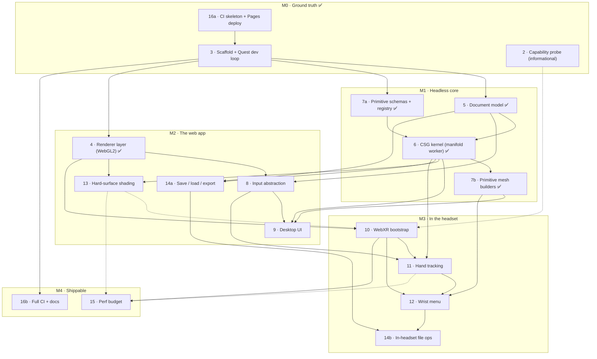

# Roadmap: dependency DAG for v1

Derived from [#1](https://github.com/kruddage/carve/issues/1) and its sub-issues. The parent issue
lists sub-issues "roughly in dependency order"; this document makes that order explicit, records
where the stated order does not survive contact with the actual dependencies, and defines the
milestones that make progress observable.

The graph is the source of truth for _what can start now_. The milestones are the source of truth
for _what you can go look at_.

## Two decisions that reshaped this graph

**The renderer is WebGL2, via three.js `WebGLRenderer`. There is no WebGPU path in v1.** WebGL2 was
already the expected shipping answer in the headset — `XRGPUBinding` is not implemented on Quest —
so the two-backend abstraction was carrying a hypothetical. Dropping it removes the project's
largest open technical risk, deletes the dual-backend work from [#4](https://github.com/kruddage/carve/issues/4),
and — most importantly — takes the last piece of hardware-gated work off the critical path. See
[#4](https://github.com/kruddage/carve/issues/4) for what the renderer layer is still for, which is
not nothing.

**The web app is a deliverable, not a staging post for the headset.** #1 says "runs in a browser tab
and in a Quest 3 headset from the same URL", and [#9](https://github.com/kruddage/carve/issues/9)
says the desktop UI "should be good on its own terms rather than a consolation prize". The old graph
did not agree: the entire desktop path was transitively blocked on a capability probe that needed a
Quest 3 in hand, shading was blocked on the XR session bootstrap, and save/export was blocked on the
wrist menu. Every one of those was a false dependency. They are gone, M2 is now the milestone that
ships a usable product, and #1 carries a done-when that a person with no headset can satisfy.

Consequence of both: **nothing between here and a working web modeler requires a headset.**

## The graph

Solid arrow = hard blocker, the downstream issue cannot start. Dotted arrow = soft, the downstream
issue can start but cannot close.

## Blockers per issue

| Issue                                                                    | Hard blockers | Soft   | Unblocks     |
| ------------------------------------------------------------------------ | ------------- | ------ | ------------ |
| [#2 Capability probe](https://github.com/kruddage/carve/issues/2)         | —             |        | 10 (soft)    |
| [#3 Scaffold + dev loop](https://github.com/kruddage/carve/issues/3) ✅   | —             | 16a    | 4, 5, 7a, 16b |
| [#4 Renderer layer](https://github.com/kruddage/carve/issues/4) ✅        | 3             |        | 8, 10, 13    |
| [#5 Document model](https://github.com/kruddage/carve/issues/5) ✅        | 3             |        | 6, 8, 14a    |
| [#6 CSG kernel](https://github.com/kruddage/carve/issues/6) ✅            | 5, 7a         |        | 7b, 9, 11, 13, 14a |
| [7a Primitive schemas](https://github.com/kruddage/carve/issues/25) ✅    | 3             |        | 6            |
| [#7 Primitive library (7b)](https://github.com/kruddage/carve/issues/7) ✅ | 6             |        | 9, 12        |
| [#8 Input abstraction](https://github.com/kruddage/carve/issues/8)        | 4, 5          |        | 9, 11        |
| [#9 Desktop UI](https://github.com/kruddage/carve/issues/9)               | 6, 7b, 8      |        | —            |
| [#10 WebXR bootstrap](https://github.com/kruddage/carve/issues/10)        | 4             | 2, 13  | 11, 12, 15   |
| [#11 Hand tracking](https://github.com/kruddage/carve/issues/11)          | 6, 8, 10      |        | 12, 15       |
| [#12 Wrist menu](https://github.com/kruddage/carve/issues/12)             | 7b, 10, 11    |        | 14b          |
| [#13 Shading](https://github.com/kruddage/carve/issues/13)                | 4, 6          | 15     | 15           |
| [#14 Persistence + export (14a)](https://github.com/kruddage/carve/issues/14) | 5, 6     |        | 14b          |
| [#14 (14b, in-headset)](https://github.com/kruddage/carve/issues/14)      | 12, 14a       |        | —            |
| [#15 Perf budget](https://github.com/kruddage/carve/issues/15)            | 10            | 11, 13 | —            |
| [#16 CI + deploy](https://github.com/kruddage/carve/issues/16)            | — (16a), 3 (16b) |     | everything   |

**Critical path:** 3 → 5 → 6 → 7b → 9, with 4 → 8 → 9 joining it. Its headless half is complete, and
so is the renderer: #6 was the single highest-fanout node — five issues waited on it — `7b` behind it
was the last of M1, and #4 has now landed too. What remains on the path to a desktop app is the input
layer and the UI above it.

**Startable right now:** [#8](https://github.com/kruddage/carve/issues/8),
[#10](https://github.com/kruddage/carve/issues/10), [#13](https://github.com/kruddage/carve/issues/13)
and [#14a](https://github.com/kruddage/carve/issues/14), in parallel and by different people. #3, #5,
`7a`, `16a`, #6, `7b` and #4 have landed. #9 needs #8, so **#8 is now the one thing standing between
here and the desktop app** — everything else left in M2 is behind it or behind work that is already
done.

The kernel's design notes are [`docs/kernel.md`](./kernel.md) and its measured timings are
[`docs/perf.md`](./perf.md). The renderer's design notes are [`docs/render.md`](./render.md).

## Findings from reviewing the issues against each other

**1. #2 and #3 were stated as mutually blocking.** #2 said it "blocks everything", but required the
LAN dev server from #3 to load; #3's done-when required the probe from #2. The way out was in #2's
own constraints: the probe is plain HTML plus one JS file with no build step, so it ships through
Pages. Resolved — it lives at [`/probe/`](https://kruddage.github.io/carve/probe/), which is the
stable bookmark #16 wanted anyway.

**2. #6 and #7 referenced each other.** #6 needs "primitive parameters → manifold solids"; #7 needs
"deterministic construction, so the subtree cache in #6 stays valid". Broken by splitting #7 into
`7a` (schemas, units, defaults, registry — pure data, no meshing) and `7b` (mesh construction,
tessellation, thumbnails — needs the kernel). Resolved: `7a` is
[#25](https://github.com/kruddage/carve/issues/25) and has landed; #7 now tracks `7b` only.

**3. #16 is listed last but a third of it is a prerequisite.** #3's import boundary is "enforced by
CI, not by discipline", and #5/#6 are the bulk of a test suite that needs somewhere to run. Split
into `16a` (Pages deploy + CI skeleton) and `16b` (boundary check, preview deploys, README,
`docs/architecture.md`). `16a` has landed.

**4. #15's instrumentation is needed earlier than #15.** Its fps/frame-time/queue-depth overlay is
the only way to evaluate #11's "frame rate holds while dragging" and #13's "measured in stereo".
Land the overlay with the `XRFrame` loop in #10; keep budget-setting and the benchmark scene in #15.

**5. The desktop path was a dependent of the headset in four places.** All four were false
dependencies and all four are now cut:

| Was | Why it was wrong |
| --- | ---------------- |
| `2 → 4` hard | Page-backend selection is a runtime feature detect. Moot now that there is one backend. |
| `10 → 13` hard | Materials, crease normals, outline pass and the ground grid are desktop-visible work with nothing to do with entering a session. Now soft — only "measured in stereo" and the passthrough treatment need #10. |
| `12 → 14` soft | Save, load, STL and glTF on the web need nothing from the wrist menu. Split into `14a` (web) and `14b` (in-headset file ops, which genuinely needs #12). |
| #15 budget | Every number in it was Quest-at-72Hz, and every lever was XR-only. A laptop user had no target anyone was holding. #15 now carries a desktop budget too. |

**6. Nothing asserted the web page works.** #16's done-when was *"the URL opens and enters immersive
mode on Quest 3"*, and #1's was a round trip through a headset. With no acceptance criterion a
headset-less person could satisfy, every close call in M2 would resolve in the headset's favour by
default. #1 now carries a second done-when, and #16b adds a Playwright smoke test against the
deployed page in desktop Chrome.

**7. The desktop browser matrix is unmeasured.** `docs/capability-matrix.md` covers desktop Chrome
and Quest 3. If "a webpage" means anyone can open the link, Safari and Firefox need rows. One
concrete trap sat behind this: **GitHub Pages cannot set COOP/COEP response headers**, so
`SharedArrayBuffer` is unavailable and #6 had to use a single-threaded `manifold-3d` build (or Pages
would need a service-worker shim). Settled before #6 started rather than after: the single-threaded
build is what shipped, and the reasoning, the escalation order and what would change the answer are
in [`docs/kernel.md`](./kernel.md).

One repo-level note, now resolved: `index.html` at the repo root was the coming-soon page and Vite
wants that exact path as its entry. #3 decided it; see `vite.config.ts`.

## Milestones, and what each one makes visible

Everything user-visible lands at one URL: **https://kruddage.github.io/carve/**. It currently serves
the coming-soon page. Each milestone changes what is there.

|                          | Issues            | Visible at                                                                                                                                                                                                                                                    |
| ------------------------ | ----------------- | ---------------------------------------------------------------------------------------------------------------------------------------------------------------------------------------------------------------------------------------------------------- |
| **M0 · Ground truth** ✅ | 3, 16a            | Green CI on every PR and the probe live at `/probe/`. Complete.                                                                                                                                                                                              |
| **M1 · Headless core** ✅ | 5 ✅, 7a ✅, 6 ✅, 7b ✅ | No pixels. Progress is the green CI check, the undo/redo fuzz test, and the kernel timings in `docs/perf.md` — now populated: a single-leaf edit on the ~20-primitive target tree re-evaluates in 6.7ms against a 16ms budget. The milestone where it looks like nothing is happening and the most is. Complete. |
| **M2 · The web app**     | 4 ✅, 8, 9, 13, 14a  | `/` stops being the coming-soon page and becomes the modeler. Booleans, outliner, gizmos, machined-looking solids, save and export — in a browser tab, on a laptop, no headset involved. **This is a shippable product, not a checkpoint.**                    |
| **M3 · In the headset**  | 10, 11, 12, 14b   | Same URL, now with an Enter XR button that works. Pinch-grab a solid, spawn primitives from the wrist menu, build a part without touching a keyboard.                                                                                                          |
| **M4 · Shippable**       | 15, 16b           | Both done-whens from #1 end to end: the web round trip, and the headset one at 72fps.                                                                                                                                                                        |

The honest answer to "where do I watch progress" is: **M0 at `/probe/` and in CI, M1 in CI and
`docs/perf.md`, M2 onward at `/`.** M1 is the stretch with nothing to look at, and #6's timings are
the checkpoint that tells you it is going well before M2 makes it obvious.
