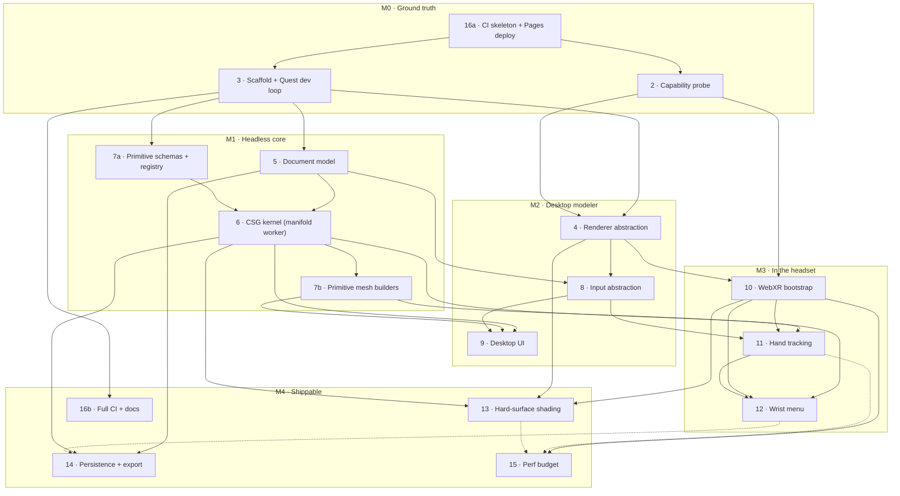

# Roadmap: dependency DAG for v1

Derived from [#1](https://github.com/kruddage/carve/issues/1) and its fifteen sub-issues. The
parent issue lists sub-issues "roughly in dependency order"; this document makes that order
explicit, records where the stated order does not survive contact with the actual dependencies,
and defines the milestones that make progress observable.

The graph is the source of truth for *what can start now*. The milestones are the source of truth
for *what you can go look at*.

## The graph

Solid arrow = hard blocker, the downstream issue cannot start. Dotted arrow = soft, the downstream
issue can start but cannot close.

## Blockers per issue

| Issue | Hard blockers | Soft | Unblocks |
|---|---|---|---|
| [#2 Capability probe](https://github.com/kruddage/carve/issues/2) | — (16a to run it on-device) | | 4, 10 |
| [#3 Scaffold + dev loop](https://github.com/kruddage/carve/issues/3) | — | 16a | 4, 5, 7a, 16b |
| [#4 Renderer abstraction](https://github.com/kruddage/carve/issues/4) | 2, 3 | | 8, 10, 13 |
| [#5 Document model](https://github.com/kruddage/carve/issues/5) | 3 | | 6, 8, 14 |
| [#6 CSG kernel](https://github.com/kruddage/carve/issues/6) | 5, 7a | | 7b, 9, 11, 13, 14 |
| [#7 Primitive library](https://github.com/kruddage/carve/issues/7) | 3 (7a), 6 (7b) | | 6, 9, 12 |
| [#8 Input abstraction](https://github.com/kruddage/carve/issues/8) | 4, 5 | | 9, 11 |
| [#9 Desktop UI](https://github.com/kruddage/carve/issues/9) | 6, 7b, 8 | | — |
| [#10 WebXR bootstrap](https://github.com/kruddage/carve/issues/10) | 2, 4 | | 11, 12, 13, 15 |
| [#11 Hand tracking](https://github.com/kruddage/carve/issues/11) | 6, 8, 10 | | 12, 15 |
| [#12 Wrist menu](https://github.com/kruddage/carve/issues/12) | 7b, 10, 11 | | 14 |
| [#13 Shading](https://github.com/kruddage/carve/issues/13) | 4, 6, 10 | 15 | 15 |
| [#14 Persistence + export](https://github.com/kruddage/carve/issues/14) | 5, 6 | 12 | — |
| [#15 Perf budget](https://github.com/kruddage/carve/issues/15) | 10 | 11, 13 | — |
| [#16 CI + deploy](https://github.com/kruddage/carve/issues/16) | — (16a), 3 (16b) | 2 | everything |

**Critical path:** 3 → 5 → 6 → 7b → 9, and in parallel 2 → 4 → 10 → 11 → 12. #6 is the single
highest-fanout node — five issues wait on it — so slippage there is felt everywhere. #2 and #3
are the only two things that can start today, which matches the parent issue's read.

## Four findings from reviewing the issues against each other

**1. #2 and #3 are stated as mutually blocking.** #2 says it "blocks everything", but its Shape
section requires it to load "over the LAN dev server from issue #3". #3's done-when in turn
requires the probe from #2 to load. As written neither can go first.

The way out is already in #2's own constraints: the probe is plain HTML plus one JS file with no
build step. It does not need Vite. Ship it through Pages — which is already serving the
coming-soon page over HTTPS — and it is on the headset without #3 existing. That also satisfies
#16's "probe deployed at a stable path, so re-checking Quest support after a browser update is
opening one bookmark", which is the more durable home for it anyway. This is why 16a sits above
both in the graph.

**2. #6 and #7 reference each other.** #6 needs "primitive parameters → manifold solids"; #7 needs
"deterministic construction, so the subtree cache in #6 stays valid". This is a real cycle, and
the graph above breaks it by splitting #7:

- **7a — parameter schemas, units, defaults, registry.** Pure data, no meshing. Blocks #6.
- **7b — mesh construction per primitive, tessellation quality, thumbnails.** Needs the kernel.
  Blocks #9 and #12.

Recommend splitting #7 into two issues, or at minimum landing 7a as the first PR against #7 so #6
is not waiting on thumbnail work.

**3. #16 is listed last but a third of it is a prerequisite.** #3's done-when says the import
boundary is "enforced by CI, not by discipline", and #5/#6 are the bulk of a test suite that needs
somewhere to run. A CI skeleton — typecheck, lint, test, build — has to exist by M1 or those
done-whens are unachievable. Split as 16a (Pages deploy + CI skeleton, now) and 16b (boundary
check, preview deploys, README, `docs/architecture.md`, once there is source to check).

**4. #15's instrumentation is needed earlier than #15.** Perf is written as an end-stage task, but
its fps/frame-time/queue-depth overlay is the only way to evaluate #11's "frame rate holds while
dragging" and #13's "measured in stereo, not just on desktop". Land the overlay as part of #10
where the `XRFrame` loop is built; leave budget-setting and the benchmark scene in #15.

One repo-level note that will bite during M2: `index.html` at the repo root is the coming-soon
page, and Vite wants that exact path as its entry. Whoever lands #3 needs to decide then whether
the landing page moves aside or becomes the app's own shell — not discover the collision at
deploy time.

## Milestones, and what each one makes visible

Everything user-visible lands at one URL: **https://kruddage.github.io/carve/**. It currently
serves the coming-soon page. Each milestone changes what is there.

| | Issues | Visible at |
|---|---|---|
| **M0 · Ground truth** | 2, 3, 16a | `/probe/` renders the capability table on the headset; `docs/capability-matrix.md` records the answer and `#1`'s WebGPU table is updated with a measurement instead of release notes. Nothing at `/` changes yet. |
| **M1 · Headless core** | 5, 6, 7a, 7b | No pixels. Progress is the green CI check on every PR, the fuzz test on undo/redo, and the first on-device numbers in `docs/perf.md`. This is the milestone where it looks like nothing is happening and the most is. |
| **M2 · Desktop modeler** | 4, 8, 9 | `/` stops being the coming-soon page and becomes the modeler. Booleans, outliner, gizmos, in a browser tab. First milestone you can show someone. |
| **M3 · In the headset** | 10, 11, 12 | Same URL, now with an Enter XR button that works. Pinch-grab a solid, spawn primitives from the wrist menu, build a part without touching a keyboard. |
| **M4 · Shippable** | 13, 14, 15, 16b | The done-when from `#1` end to end: model on a laptop, reopen on Quest, export an STL that measures correctly in a slicer, at 72fps. |

The honest answer to "where do I watch progress" is: **M0 at `/probe/`, M1 in CI and
`docs/perf.md`, M2 onward at `/`.** M1 is the stretch with nothing to look at, and #6's
performance target being recorded on-device is the checkpoint that tells you it is going well
before M2 makes it obvious.
